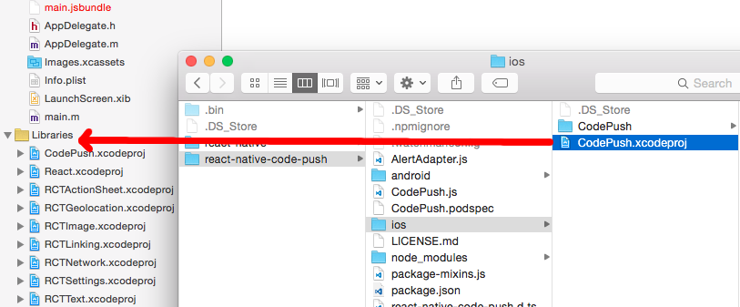
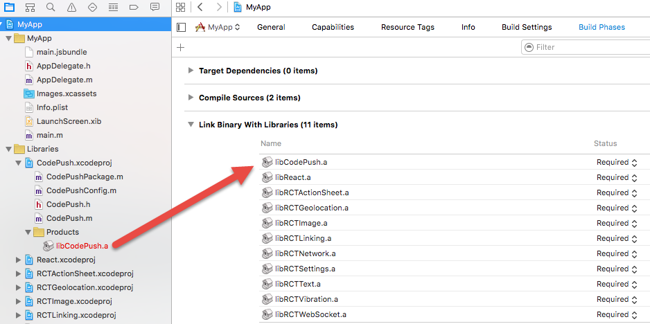
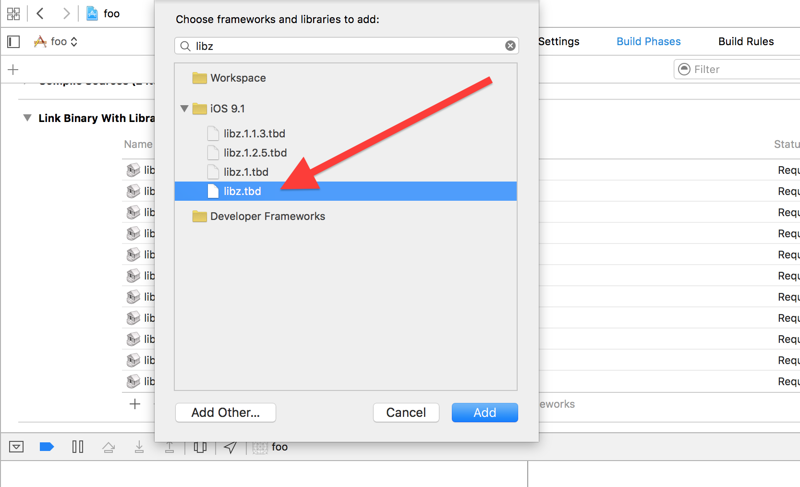

# Code Push 集成

### 安装注册 CodePush CLI
1. `sudo npm install -g code-push-cli`
2. 创建账号：`code-push register`
3. 为每个平台注册 `App`
    
    ```
    code-push app add MyApp-iOS ios react-native
code-push app add MyApp-Android android react-native
    ```
_`CodePush CLI` 安装及 `App` 注册已完成_

---

### 项目集成 CodePush SDK
`npm install --save react-native-code-push`

---

#### iOS
***三种方法任选其一***

- **RNPM**

    ```
    react-native version >= 0.27: react-native link react-native-code-push (rnpm link 在 0.27 版本后被整合在 react native CLI)
    react-native version < 0.27: rnpm link react-native-code-push
    ```
    
- **CocoaPods**
    
    `Podfile ` 文件中添加（注意路径和自己项目对应）：
    `pod 'CodePush', :path => '../node_modules/react-native-code-push'`
并配置 `React`, 如下：


    ```
    
    # The target name is most likely the name of your project.
    target 'NumberTileGame' do

     # Your 'node_modules' directory is probably in the root of your project,
     # but if not, adjust the `:path` accordingly
     pod 'React', :path => '../node_modules/react-native', :subspecs => [
    'Core',
    'CxxBridge', # Include this for RN >= 0.47
    'DevSupport', # Include this to enable In-App Devmenu if RN >= 0.43
    'RCTText',
    'RCTNetwork',
    'RCTWebSocket', # Needed for debugging
    'RCTAnimation', # Needed for FlatList and animations running on native UI thread
    # Add any other subspecs you want to use in your project
     ]
           # Explicitly include Yoga if you are using RN >= 0.42.0
     pod 'yoga', :path => '../node_modules/react-native/ReactCommon/yoga'
  
     end
    
    ```

    最后：`pod install`
    
    
- **手动**



最后：`Other Linker Flags` 添加 `-lz`


-

***代码部分***

1. `AppDelegate.m` 添加 `#import <CodePush/CodePush.h>`
2. 修改 `jsCodeLocation`
    ***react-native version >= 0.49***
    
    ```
    NSURL *jsCodeLocation;

    #ifdef DEBUG
    jsCodeLocation = [NSURL URLWithString:@"http://localhost:8081/index.bundle?platform=ios&dev=true"];
    #else
    jsCodeLocation = [CodePush bundleURL];
    #endif
    
    ```
    
    ***react-native version < 0.49***
    
    ```
    NSURL *jsCodeLocation;

    #ifdef DEBUG
    jsCodeLocation = [NSURL URLWithString:@"http://localhost:8081/index.ios.bundle?platform=ios&dev=true"];
    #else
    jsCodeLocation = [CodePush bundleURL];
    #endif
    
    ```


---

#### Android
***两种方案引库，任选其一：***

- **RNPM**

    ```
    react-native version >= 0.27: react-native link react-native-code-push (rnpm link 在 0.27 版本后被整合在 react native CLI)
    react-native version < 0.27: rnpm link react-native-code-push
    ```
    
- **手动**
 1. `android/settings.gradle` 添加 
    
        ```
        
        include ':app', ':react-native-code-push'
        project(':react-native-code-push').projectDir = new File(rootProject.projectDir, '../node_modules/react-native-code-        push/android/app')
        ```
    2. `android/app/build.gradle` 添加
    
        ```
        dependencies {
    ...
    compile project(':react-native-code-push')
}
        ```
    3. `android/app/build.gradle` 添加
    
        ```
...
apply from: "../../node_modules/react-native/react.gradle"
apply from: "../../node_modules/react-native-code-push/android/codepush.gradle"
...
        
        ```
        
-
        
***代码部分***

1. `MainApplication.java` 文件

    react-native version >= 0.29

    ```
    @Override
    protected List<ReactPackage> getPackages() {
    return Arrays.<ReactPackage>asList(
        ...
        new CodePush(BuildConfig.CODEPUSH_KEY, MainApplication.this, BuildConfig.DEBUG), // Add/change this line.
        ...
    );
}
    
    ```
    
    react-native version  v0.19 - v0.28
    
    ```
    @Override
    protected List<ReactPackage> getPackages() {
    return Arrays.<ReactPackage>asList(
        ...
        new CodePush(BuildConfig.CODEPUSH_KEY, this, BuildConfig.DEBUG), // Add/change this line.
        ...
    );
}
    
    ```

---

### 发布补丁

***常用命令见下***

code-push 发布补丁简单到通过一行命令即可发布出去：

```
code-push release-react MyApp ios -m --description "描述" --targetBinaryVersion "~1.0.2" --deploymentName Production
```

`-m`: 强制更新
`ios`: 补丁发布的平台
`targetBinaryVersion`: 发布到的 `App` 版本号
`deploymentName`: 发布的环境

_强烈不建议直接通过上边的命令，直接发布补丁到 `Production` 环境，建议使用下面解决方案_

1. `Xcode` -> `info.plist` -> 修改 `CodePushDeploymentKey` 值为 `Staging key`
2. 打包 `.ipa` 安装到手机。
3. 通过发布补丁命令，发布补丁，手机测试。
4. 测试通过后，运行 `code-push promote MyApp Staging Production --des "描述" -m` 将补丁推送到生产环境


### 常用命令

1. 添加 App `code-push app add MyApp`
2. 列出账号下 `app` 列表 `code-push app ls`
3. 查看 `Key`: `code-push deployment ls MyApp -k`
4. 移除补丁: `code-push deployment rm MyApp Production`

### 参考
* [react-native-code-push](https://github.com/Microsoft/react-native-code-push)
* [CodePush CLI](http://microsoft.github.io/code-push/docs/getting-started.html)

